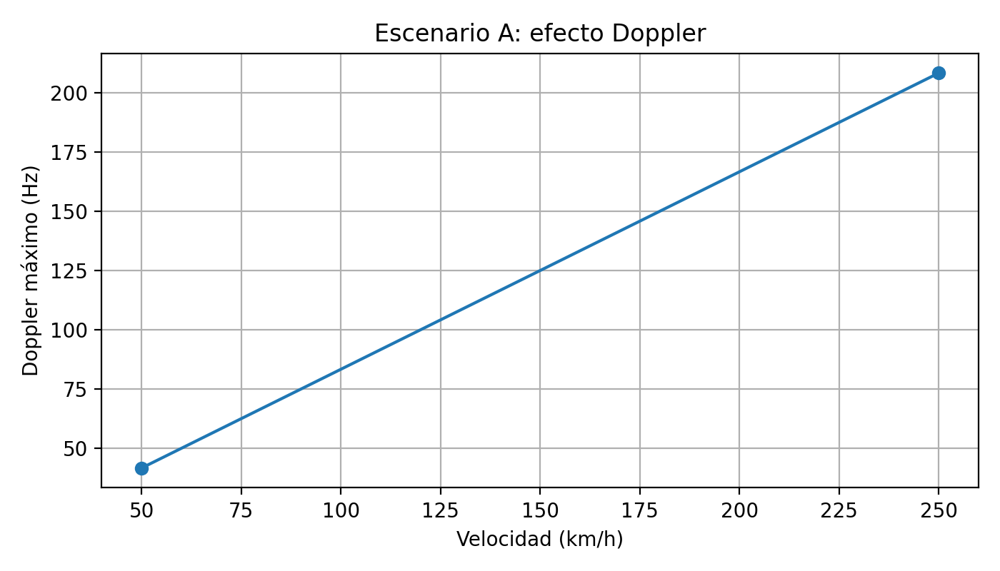
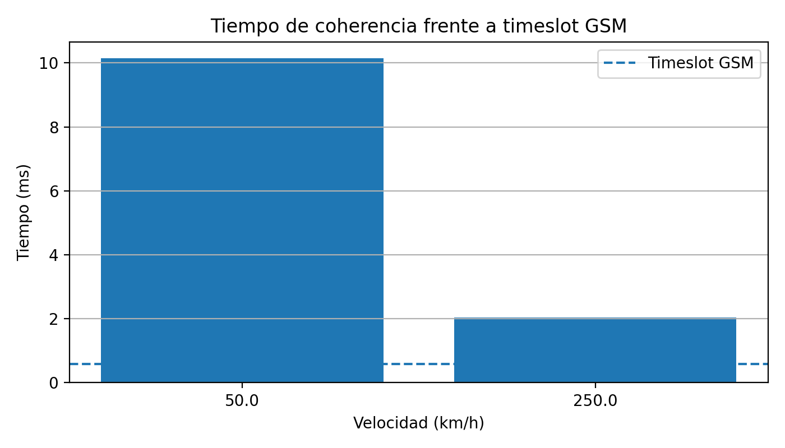
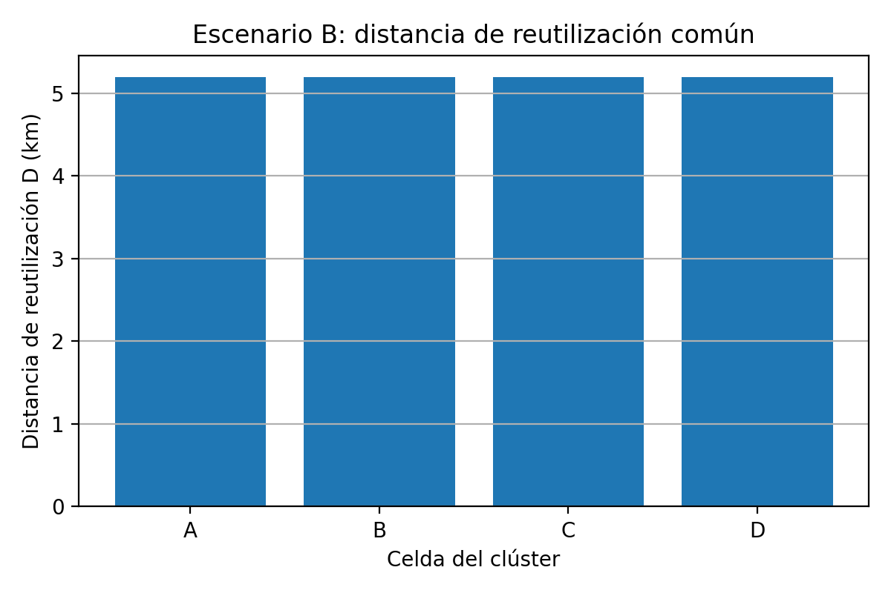
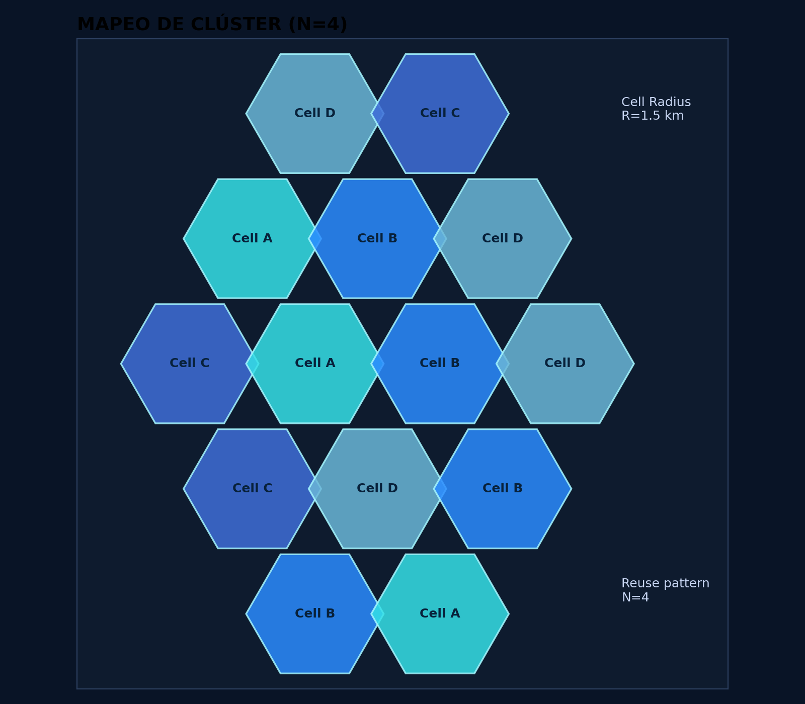
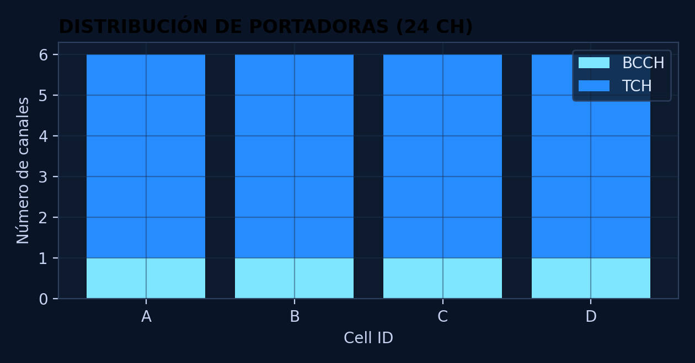
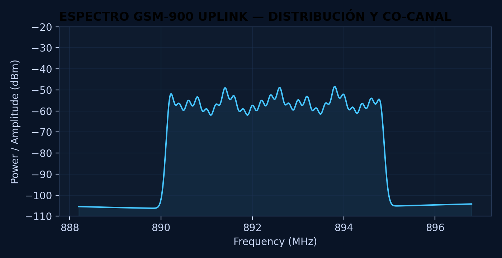
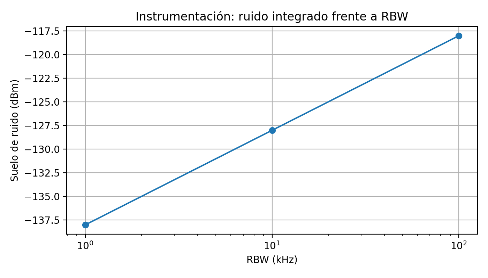

# Protocolo Titán — Informe técnico docente

## Resumen

Este informe evalúa la viabilidad de una red GSM/EDGE táctica en dos contextos de misión crítica: movilidad extrema en un convoy ferroviario y alta densidad operativa en un campamento base. Se parte de una red GSM-900 con portadoras de 200 kHz, un timeslot de 577 µs, velocidades de estudio 50 km/h, 250 km/h y un plan celular con 24 ARFCNs distribuidos en un clúster N=4.
Los resultados muestran que el escenario A está dominado por la variación temporal del canal, mientras que el escenario B queda condicionado por la reutilización espectral, la protección co-canal y el criterio instrumental de medida.

## 1. Introducción

El reto Protocolo Titán plantea el diseño de una red táctica de alta fiabilidad basada en GSM/EDGE. Aunque se trata de una arquitectura histórica, sigue siendo útil como referencia docente porque combina robustez, interoperabilidad, sencillez de despliegue y una estructura radio bien documentada [1], [2].
Desde la perspectiva de misión crítica, la red debe soportar coordinación de voz, control de equipos, telemetría de baja tasa y decisiones de ingeniería que preserven tanto la disponibilidad del enlace como el uso disciplinado del espectro.
### 1.1 Objetivo general

Demostrar, con cálculos reproducibles y criterio ingenieril, la viabilidad de una red GSM/EDGE táctica en un escenario de alta movilidad y en un entorno de alta densidad operativa.

### 1.2 Objetivos específicos

- Cuantificar el efecto Doppler y el tiempo de coherencia para velocidades tácticas representativas.
- Determinar si el canal puede considerarse aproximadamente estable durante un timeslot GSM.
- Diseñar una planificación básica de frecuencias con 24 ARFCNs y clúster N=4.
- Justificar el papel de BCCH, TCH y la política de potencia/hopping en el reparto de canales.
- Analizar cómo cambia el suelo de ruido instrumental al modificar la RBW del analizador.
- Integrar movilidad, reutilización y certificación RED en una propuesta coherente de despliegue.

## 2. Estado del arte

### 2.1 Acceso múltiple en GSM/EDGE

GSM organiza el acceso radio mediante FDMA y TDMA. En frecuencia, el espectro se divide en portadoras de 200 kHz; en tiempo, cada portadora se reparte en 8 timeslots por trama, con un timeslot base de 577 µs [1], [2].

### 2.2 Canales físicos y canales lógicos

Un canal físico es la combinación portadora-timeslot. Sobre él se multiplexan canales lógicos con finalidades distintas: BCCH para difusión y camping, TCH para tráfico y otros canales de control para señalización, acceso y sincronización. En consecuencia, la capacidad útil de usuario nunca debe interpretarse como una mera cuenta bruta de timeslots.

### 2.3 Fading, multitrayecto y movilidad

El fading por multitrayecto aparece cuando varias réplicas temporales de la señal interfieren constructiva o destructivamente. Un entorno sin línea de vista dominante suele aproximarse por Rayleigh, mientras que la presencia de una componente fuerte LOS conduce a un comportamiento Rician [3], [4].
Cuando el ancho de banda de la señal es pequeño frente al ancho de banda de coherencia, el canal puede modelarse como fading plano; si no, aparecen efectos selectivos en frecuencia. En este reto se usa una simulación docente de fading plano para estudiar la estabilidad intra-ráfaga.

### 2.4 Certificación radioeléctrica y Directiva RED

El despliegue radio no se limita a la capacidad de servicio: también exige control de emisiones no deseadas, uso eficiente del espectro y trazabilidad de medidas. La Directiva RED aporta el marco regulatorio de conformidad, mientras que el analizador de espectro y el ajuste de RBW permiten distinguir señales débiles de ruido instrumental [5].

## 3. Metodología

### 3.1 Hipótesis de partida

- Banda de operación: GSM-900 con frecuencia central aproximada de 900 MHz.
- Acceso radio: portadoras de 200 kHz y 8 timeslots por trama.
- Timeslot analizado: 577 µs.
- Velocidad de propagación: `3 × 10^8 m/s`.
- Figura de ruido del analizador: 6 dB.

### 3.2 Ecuaciones empleadas

- Conversión de velocidad: `v(m/s) = v(km/h) / 3.6`.
- Doppler máximo: `f_d = v · f_c / c`.
- Tiempo de coherencia: `T_c ≈ 0.423 / f_d`.
- Reutilización celular: `D/R = √(3N)` y `D = R · √(3N)`.
- Suelo de ruido instrumental: `N(dBm) = -174 + 10 log10(RBW) + NF`.

### 3.3 Flujo reproducible

1. Convertir velocidades de km/h a m/s y calcular Doppler máximo.
2. Obtener el tiempo de coherencia y compararlo con el timeslot GSM.
3. Simular fading plano Rayleigh y Rician para visualizar variación de envolvente.
4. Repartir 24 portadoras entre las celdas del clúster y calcular la distancia de reutilización.
5. Evaluar el impacto de la RBW del analizador sobre el ruido integrado.
6. Integrar resultados en una discusión común orientada a decisiones de despliegue.

## 4. Escenarios de estudio

### 4.1 Escenario A — Convoy de alta velocidad

Se estudia un despliegue lineal en un valle operativo con radio de celda 3 km y velocidades 50 km/h, 250 km/h. Aquí domina la movilidad extrema: el problema principal no es la cantidad de portadoras disponibles, sino la rapidez con la que cambia el canal radio dentro de una ráfaga GSM.

### 4.2 Escenario B — Campamento base y certificación

Se analiza un campamento base con radio de celda 1.5 km, 24 portadoras disponibles y clúster N=4. En este contexto dominan la planificación espectral, la interferencia co-canal y la verificación instrumental de emisiones.

Mini conclusión parcial: los dos escenarios son complementarios. El primero exige analizar estabilidad temporal del canal; el segundo exige disciplina de espectro y criterio de certificación.

## 5. Pruebas, cálculos y simulaciones

### 5.1 Prueba 1 — Movilidad y fading

#### Caso 50 km/h

1. Conversión de velocidad: `v = 50 / 3.6 = 13.8889 m/s`.
2. Desviación Doppler máxima: `f_d = v · f_c / c = 13.8889 · 900e6 / 3e8 = 41.6667 Hz`.
3. Tiempo de coherencia: `T_c ≈ 0.423 / f_d = 0.423 / 41.6667 = 0.010152 s = 10.152 ms`.
4. Comparación con el timeslot GSM: `T_c / T_slot = 10.152 / 0.577 = 17.5945`.
Interpretación: el canal se clasifica como **cuasiestatico**. Por tanto, la ráfaga puede considerarse cuasiestática o estable dentro del timeslot, pero la robustez del enlace sigue dependiendo de codificación, entrelazado y margen de diseño.

Mini conclusión parcial: la movilidad extrema incrementa el Doppler y reduce el tiempo de coherencia; sin embargo, con los parámetros base el canal sigue siendo manejable dentro de una ráfaga GSM.

#### Caso 250 km/h

1. Conversión de velocidad: `v = 250 / 3.6 = 69.4444 m/s`.
2. Desviación Doppler máxima: `f_d = v · f_c / c = 69.4444 · 900e6 / 3e8 = 208.3333 Hz`.
3. Tiempo de coherencia: `T_c ≈ 0.423 / f_d = 0.423 / 208.3333 = 0.00203 s = 2.0304 ms`.
4. Comparación con el timeslot GSM: `T_c / T_slot = 2.0304 / 0.577 = 3.5189`.
Interpretación: el canal se clasifica como **estable_con_margen_reducido**. Por tanto, la ráfaga puede considerarse cuasiestática o estable dentro del timeslot, pero la robustez del enlace sigue dependiendo de codificación, entrelazado y margen de diseño.

Mini conclusión parcial: la movilidad extrema incrementa el Doppler y reduce el tiempo de coherencia; sin embargo, con los parámetros base el canal sigue siendo manejable dentro de una ráfaga GSM.

Las métricas de fading exportadas permiten comparar la dispersión relativa de la envolvente en escenarios Rayleigh y Rician. En general, el caso Rician presenta menor variación pico a pico por la presencia de una componente dominante.

### 5.2 Prueba 2 — Planificación de frecuencias

1. Reparto espectral: `24 / 4 = 6` portadoras por celda.
2. Relación de reutilización: `D/R = √(3N) = √(3 · 4) = 3.4641`.
3. Distancia de protección: `D = R · √(3N) = 1.5 · 3.4641 = 5.1962 km`.
4. Interpretación: la distancia de reutilización actúa como separación geométrica mínima entre celdas co-canal; cuanto mayor es, mayor protección frente a interferencia, pero menor densidad espectral efectiva.
5. Política BCCH/TCH: BCCH se mantiene estable y a potencia fija para asegurar camping, sincronización y acceso; en cambio, TCH puede beneficiarse de hopping y control de potencia cuando la infraestructura lo soporte.

Mini conclusión parcial: el clúster N=4 introduce un compromiso razonable entre capacidad y protección co-canal para un despliegue táctico con disciplina espectral.

### 5.3 Prueba 3 — Certificación y suelo de ruido

- RBW = 100 kHz: `N = -174 + 10 log10(100000) + 6 = -118 dBm`.
- RBW = 10 kHz: `N = -174 + 10 log10(10000) + 6 = -128 dBm`.
- RBW = 1 kHz: `N = -174 + 10 log10(1000) + 6 = -138 dBm`.

Interpretación: al reducir la RBW disminuye el ruido integrado por el analizador, lo que mejora la visibilidad de señales débiles. Sin embargo, esa mejora no implica que la señal real aumente: simplemente mejora la relación visual señal-ruido en la medida.
Compromiso experimental: una RBW muy estrecha reduce el ruido mostrado, pero incrementa el tiempo de barrido y puede ralentizar la validación de conformidad.

Mini conclusión parcial: el analizador debe ajustarse con criterio. Una RBW demasiado ancha oculta señales débiles en el ruido; una demasiado estrecha penaliza el tiempo de medida.

### 5.4 Interpretación integrada

Los resultados no deben leerse como tres bloques independientes. El escenario A demuestra que la estabilidad intra-ráfaga puede mantenerse incluso con movilidad elevada, lo que avala el uso de GSM/EDGE cuando se prioriza robustez y simplicidad. El escenario B muestra que esa robustez solo es útil si la planificación de frecuencias, el reparto BCCH/TCH y el criterio instrumental preservan el servicio frente a interferencia y falsas interpretaciones de laboratorio.

## 6. Resultados

### 6.1 Tabla comparativa de movilidad

| scenario | cell_radius_km | speed_kmh | speed_ms | carrier_frequency_mhz | max_doppler_hz | coherence_time_ms | gsm_timeslot_ms | coherence_to_timeslot_ratio | stability_class |
| --- | --- | --- | --- | --- | --- | --- | --- | --- | --- |
| A_convoy_alta_velocidad | 3 | 50 | 13.8889 | 900 | 41.6667 | 10.152 | 0.577 | 17.5945 | cuasiestatico |
| A_convoy_alta_velocidad | 3 | 250 | 69.4444 | 900 | 208.333 | 2.0304 | 0.577 | 3.51889 | estable_con_margen_reducido |

### 6.2 Métricas de fading

| model | doppler_hz | envelope_min | envelope_max | envelope_std | relative_peak_to_peak | speed_kmh | coherence_time_ms | stability_class |
| --- | --- | --- | --- | --- | --- | --- | --- | --- |
| rayleigh | 41.6667 | 0.00894961 | 3.32166 | 0.586993 | 3.31271 | 50 | 10.152 | cuasiestatico |
| rician | 41.6667 | 0.734056 | 1.25486 | 0.100871 | 0.5208 | 50 | 10.152 | cuasiestatico |
| rayleigh | 208.333 | 0.145474 | 3.0415 | 0.453328 | 2.89602 | 250 | 2.0304 | estable_con_margen_reducido |
| rician | 208.333 | 0.694197 | 1.2311 | 0.105082 | 0.536901 | 250 | 2.0304 | estable_con_margen_reducido |

### 6.3 Planificación de frecuencias

| scenario | cell | cell_radius_km | cluster_size_N | total_carriers | carriers_per_cell | arfcn_range | arfcn_list | reuse_ratio_D_over_R | reuse_distance_km |
| --- | --- | --- | --- | --- | --- | --- | --- | --- | --- |
| B_campamento_base | A | 1.5 | 4 | 24 | 6 | 1-6 | 1, 2, 3, 4, 5, 6 | 3.4641 | 5.19615 |
| B_campamento_base | B | 1.5 | 4 | 24 | 6 | 7-12 | 7, 8, 9, 10, 11, 12 | 3.4641 | 5.19615 |
| B_campamento_base | C | 1.5 | 4 | 24 | 6 | 13-18 | 13, 14, 15, 16, 17, 18 | 3.4641 | 5.19615 |
| B_campamento_base | D | 1.5 | 4 | 24 | 6 | 19-24 | 19, 20, 21, 22, 23, 24 | 3.4641 | 5.19615 |

### 6.4 Canales lógicos y físicos

| cell | arfcn | carrier_role | frequency_hopping_recommended | power_policy | available_timeslots | engineering_note |
| --- | --- | --- | --- | --- | --- | --- |
| A | 1 | BCCH/CCCH control | False | fixed/stable | 8 | BCCH debe ser detectable y estable para camping, sincronización y control. |
| A | 2 | TCH traffic | True | adaptive if supported | 8 | TCH transporta tráfico; puede beneficiarse de hopping y control de potencia. |
| A | 3 | TCH traffic | True | adaptive if supported | 8 | TCH transporta tráfico; puede beneficiarse de hopping y control de potencia. |
| A | 4 | TCH traffic | True | adaptive if supported | 8 | TCH transporta tráfico; puede beneficiarse de hopping y control de potencia. |
| A | 5 | TCH traffic | True | adaptive if supported | 8 | TCH transporta tráfico; puede beneficiarse de hopping y control de potencia. |
| A | 6 | TCH traffic | True | adaptive if supported | 8 | TCH transporta tráfico; puede beneficiarse de hopping y control de potencia. |
| B | 7 | BCCH/CCCH control | False | fixed/stable | 8 | BCCH debe ser detectable y estable para camping, sincronización y control. |
| B | 8 | TCH traffic | True | adaptive if supported | 8 | TCH transporta tráfico; puede beneficiarse de hopping y control de potencia. |
| B | 9 | TCH traffic | True | adaptive if supported | 8 | TCH transporta tráfico; puede beneficiarse de hopping y control de potencia. |
| B | 10 | TCH traffic | True | adaptive if supported | 8 | TCH transporta tráfico; puede beneficiarse de hopping y control de potencia. |
| B | 11 | TCH traffic | True | adaptive if supported | 8 | TCH transporta tráfico; puede beneficiarse de hopping y control de potencia. |
| B | 12 | TCH traffic | True | adaptive if supported | 8 | TCH transporta tráfico; puede beneficiarse de hopping y control de potencia. |
| C | 13 | BCCH/CCCH control | False | fixed/stable | 8 | BCCH debe ser detectable y estable para camping, sincronización y control. |
| C | 14 | TCH traffic | True | adaptive if supported | 8 | TCH transporta tráfico; puede beneficiarse de hopping y control de potencia. |
| C | 15 | TCH traffic | True | adaptive if supported | 8 | TCH transporta tráfico; puede beneficiarse de hopping y control de potencia. |
| C | 16 | TCH traffic | True | adaptive if supported | 8 | TCH transporta tráfico; puede beneficiarse de hopping y control de potencia. |
| C | 17 | TCH traffic | True | adaptive if supported | 8 | TCH transporta tráfico; puede beneficiarse de hopping y control de potencia. |
| C | 18 | TCH traffic | True | adaptive if supported | 8 | TCH transporta tráfico; puede beneficiarse de hopping y control de potencia. |
| D | 19 | BCCH/CCCH control | False | fixed/stable | 8 | BCCH debe ser detectable y estable para camping, sincronización y control. |
| D | 20 | TCH traffic | True | adaptive if supported | 8 | TCH transporta tráfico; puede beneficiarse de hopping y control de potencia. |
| D | 21 | TCH traffic | True | adaptive if supported | 8 | TCH transporta tráfico; puede beneficiarse de hopping y control de potencia. |
| D | 22 | TCH traffic | True | adaptive if supported | 8 | TCH transporta tráfico; puede beneficiarse de hopping y control de potencia. |
| D | 23 | TCH traffic | True | adaptive if supported | 8 | TCH transporta tráfico; puede beneficiarse de hopping y control de potencia. |
| D | 24 | TCH traffic | True | adaptive if supported | 8 | TCH transporta tráfico; puede beneficiarse de hopping y control de potencia. |

### 6.5 Instrumentación y RBW

| rbw_hz | rbw_khz | noise_figure_db | noise_floor_dbm | delta_vs_100khz_db | measurement_interpretation |
| --- | --- | --- | --- | --- | --- |
| 100000 | 100 | 6 | -118 | 0 | RBW ancho: medida rápida, más ruido integrado. |
| 10000 | 10 | 6 | -128 | -10 | RBW estrecho: menor ruido integrado, barrido más lento. |
| 1000 | 1 | 6 | -138 | -20 | RBW estrecho: menor ruido integrado, barrido más lento. |

### 6.6 Checklist RED orientativo

| area | evidence | student_task |
| --- | --- | --- |
| Uso eficiente del espectro | planificación ARFCN, clúster N=4, distancia de reutilización y control de co-canal | Justificar que la asignación espectral reduce interferencias y evita solapamientos. |
| Emisiones no deseadas | medida con analizador de espectro y ajuste de RBW | Explicar cómo se distinguirían señales débiles de ruido instrumental. |
| Estabilidad de canal | Doppler, tiempo de coherencia y comparación con timeslot GSM | Defender si el enlace es viable durante la ráfaga en movilidad. |
| Documentación técnica | tablas, gráficas, hipótesis y trazabilidad de cálculos | Incluir ecuaciones, unidades y discusión ingenieril. |

### 6.7 Figuras recomendadas para el informe

## 7. Discusión y conclusiones

### 7.1 Discusión

En el escenario A, el peor caso temporal sigue siendo **estable_con_margen_reducido**, mientras que el mejor caso alcanza **cuasiestatico**. Esto sugiere que la red puede operar con márgenes razonables en movilidad, siempre que el diseño conserve codificación robusta, control de potencia y suficiente sensibilidad radio.
En el escenario B, el reparto de 6 portadoras por celda y la distancia de protección de 5.1962 km ofrecen una configuración coherente con un despliegue disciplinado. La existencia de 4 portadoras BCCH dedicadas refuerza la accesibilidad de la red a costa de reducir ligeramente el tráfico bruto disponible.
Desde el punto de vista de certificación, la interpretación correcta de la RBW evita errores frecuentes: reducir ruido mostrado no significa aumentar potencia real. Ese matiz es crucial para no sobreestimar el comportamiento de emisiones espurias o señales débiles.

### 7.2 Conclusiones

1. GSM/EDGE sigue siendo una referencia válida para entornos tácticos donde priman robustez, interoperabilidad y sencillez operativa.
2. La movilidad analizada no invalida el enlace intra-ráfaga; el impacto de Doppler es apreciable pero gestionable con diseño conservador.
3. El clúster N=4 proporciona un equilibrio razonable entre capacidad y protección co-canal en el campamento base.
4. BCCH debe mantenerse estable y fácilmente detectable; TCH puede optimizarse con mayor flexibilidad operativa.
5. La configuración del analizador de espectro forma parte del diseño ingenieril porque condiciona la lectura correcta de conformidad y emisiones no deseadas.

## 8. Limitaciones y trabajo futuro

- El modelo de fading empleado es docente y no sustituye a una simulación completa tipo Jakes o a medidas de campo.
- La asignación de ARFCNs es consecutiva y no incorpora coordinación real basada en campañas de medida.
- La capacidad de tráfico se resume de forma pedagógica y no modela todos los canales lógicos de control de una red comercial completa.
- Como trabajo futuro, puede ampliarse el proyecto con balance de enlace, C/I estimada y comparación con tecnologías más modernas de misión crítica.

## 9. Referencias

[1] 3GPP TS 45.002, *Multiplexing and multiple access on the radio path*.
[2] 3GPP TS 45.001, *Physical layer on the radio path; General description*.
[3] T. S. Rappaport, *Wireless Communications: Principles and Practice*, 2nd ed. Prentice Hall, 2002.
[4] B. Sklar, *Digital Communications: Fundamentals and Applications*, 2nd ed. Prentice Hall, 2001.
[5] Directive 2014/53/EU of the European Parliament and of the Council of 16 April 2014 on radio equipment (RED).
